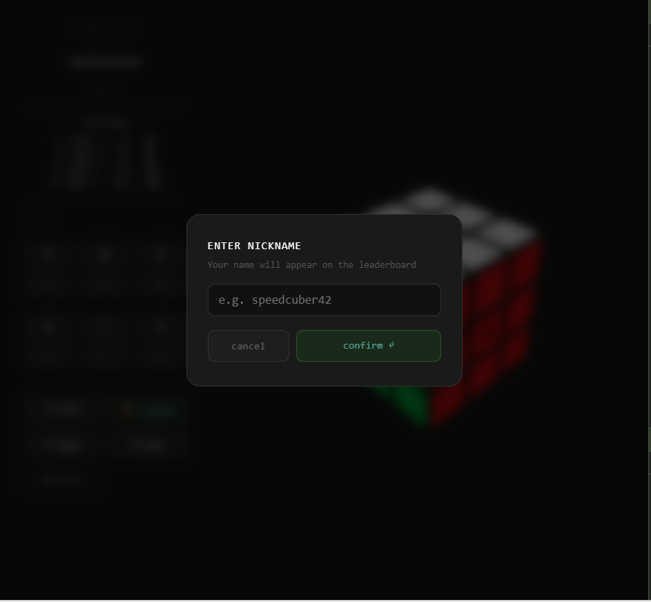
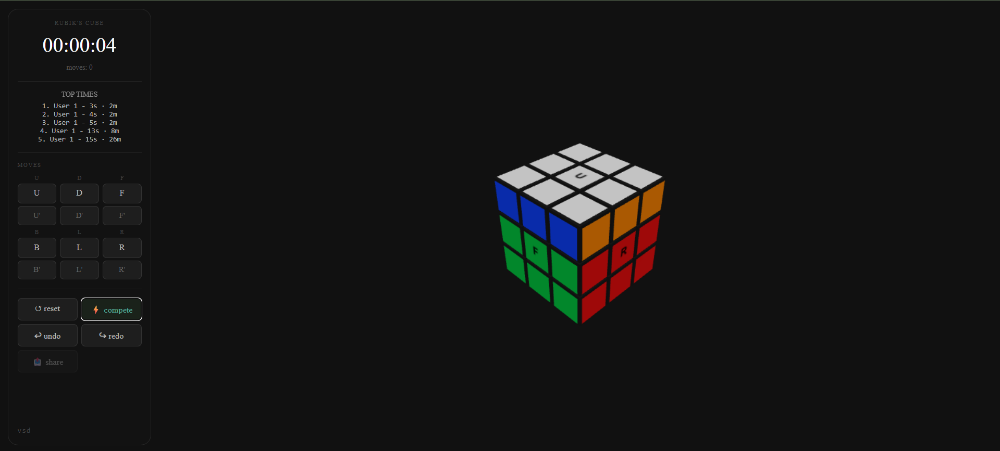

# 🧊 Rubik Cube Environment

A 3D Rubik's Cube simulator with a FastAPI backend and interactive Three.js visualization.
   

## User guide
The application is accessible via this link (cold started, via render service) 
https://rubik-cube-service.onrender.com
- Choose your nickname

- Start solving


## Contribute

**1. Install [UV](https://astral.sh/uv)**

```bash
# Linux / macOS
curl -LsSf https://astral.sh/uv/install.sh | sh

# Windows
powershell -ExecutionPolicy ByPass -c "irm https://astral.sh/uv/install.ps1 | iex"
```

**2. Clone & run**

```bash
uv sync
uv run pytest src/test/ -v
uv run uvicorn src.main.api.render:app --reload
```

Open **http://localhost:8000**

---

## API

| Method | Endpoint | Description |
|--------|----------|-------------|
| `GET` | `/cube` | Current cube state |
| `POST` | `/move/{0-11}` | Apply a move |
| `POST` | `/reset` | Reset to solved |

### Moves (0–11)

| ID | Move | ID | Move |
|----|------|----|------|
| 0  | U    | 1  | U'   |
| 2  | D    | 3  | D'   |
| 4  | F    | 5  | F'   |
| 6  | B    | 7  | B'   |
| 8  | L    | 9  | L'   |
| 10 | R    | 11 | R'   |

### Face color mapping

| Face | Index | Color  |
|------|-------|--------|
| U    | 0     | White  |
| F    | 1     | Green  |
| D    | 2     | Yellow |
| L    | 3     | Orange |
| B    | 4     | Blue   |
| R    | 5     | Red    |

---

## Usage

```python
from cube_env.cube import RubikCube3D

cube = RubikCube3D()
cube.apply_action(0)   # U
cube.apply_action(5)   # F'
print(cube.export())
```

```bash
# Or via curl
curl -X POST http://localhost:8000/move/0
curl -X POST http://localhost:8000/reset
```

---

## Supported features
✅ Interactive 3D cube<br>✅ Mouse controls
<br>✅ Undo / Redo
<br>✅ Scramble / Competition mode
<br>✅ Timer
<br>✅ Move counter
<br>✅ Solver endpoint (admin protected)
<br>✅ Persistent leaderboard (Postgres)
<br>✅ Nicknames
<br>✅ Share results
<br>✅ Multi-user isolation via cookies
<br>✅ Public deployment
<br>✅ Automatic deployment from Git

## Roadmap
☐ User accounts
<br>
☐ Multiplayer races


---

## License

Apache 2.0